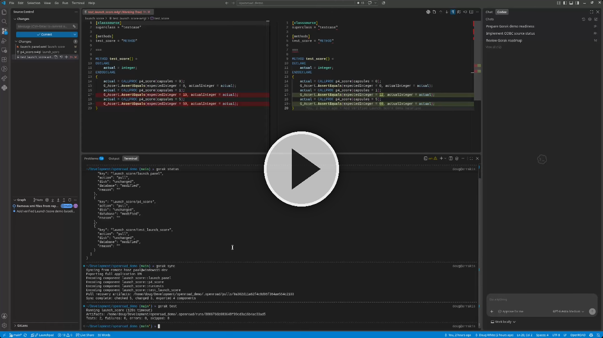
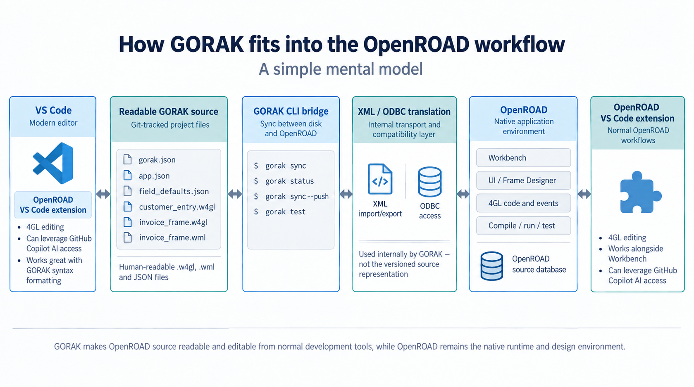

# gorak

GORAK — the Greater OpenROAD Application Kit.

Work with OpenROAD source using readable files, Git, VS Code, command-line tests,
and AI coding agents.

> **Early alpha.** Gorak is still evolving. Use a disposable development source
> database and keep backups; do not point it at production source yet.

## Demo

[](https://www.youtube.com/watch?v=owvU7R1rD-I)

The demo shows the normal Gorak development loop end to end:

- export an OpenROAD application into readable `.w4gl` / `.wml` source;
- edit and synchronize changes with OpenROAD;
- run OpenROAD tests from the command line;
- use an AI coding agent to make a real feature change; and
- review the resulting source and Git diff.

[The disposable OpenROAD application used in the video](https://github.com/dougwhite/openroad_demo)

[Follow the project or subscribe for email updates](https://thingsdougmakes.au/projects/gorak/)

## Setup

We recommend [`uv`](https://docs.astral.sh/uv/) for the best development experience.

Clone the repo and install the development environment:

```bash
git clone https://github.com/dougwhite/gorak.git
cd gorak
uv sync
```

Run the test suite:

```bash
uv run pytest
```

Install the tool in editable mode:

```bash
uv tool install --editable .
```

## Quickstart

Check the CLI:

```bash
gorak --help
```

Create a local Gorak project:

```bash
gorak new myproject
cd myproject
```

This creates a small example project including connection settings, agent
instructions, project metadata and a starter application.

Copy the example environment file:

```bash
cp .env.example .env
```

Modify `.env` to match your OpenROAD / Ingres development environment. For a local
OpenROAD installation, the basic settings look like:

```env
GORAK_BACKEND=local
GORAK_VNODE=myvnode
GORAK_DATABASE=exampledb
```

> See the [Configuration Guide](docs/config.md) for local, remote/SSH and ODBC setup.

List the applications available in the configured OpenROAD source database:

```bash
gorak app list
```

Export an existing application into readable source files:

```bash
gorak app export myapplication
```

From there, the normal development loop is deliberately simple:

```bash
gorak sync                       # pull the latest OpenROAD changes
# edit .w4gl / .wml files in your editor
gorak sync --push                # push disk changes back to OpenROAD
gorak test                       # run configured OpenROAD tests
git diff                         # review the result
```

`gorak test` runs the source currently in the OpenROAD database, so disk changes
must be synchronized first. `gorak status` shows the current disk/database change
plan when you want to inspect what Gorak thinks has changed.

New projects include an `AGENTS.md` describing this workflow for coding agents such
as Codex, so an agent can pull source, make a change, synchronize it, run the tests,
and prepare a Git change using the same commands as a human developer.

## Full Documentation

- [Getting Started](docs/getting-started.md) - First project, prerequisites and connection setup
- [Full Command List](docs/commands.md) - CLI commands and options
- [Configuration Guide](docs/config.md) - Local, remote and ODBC configuration
- [Synchronization](docs/synchronization.md) - Status, pull/push, conflicts and recovery
- [Component Editing](docs/component-editing.md) - Current readable editing surface and limits
- [Run and Test](docs/run-test.md) - Execute applications and collect test results
- [Component Import](docs/import.md) - Import an individual existing component
- [Files and Formats](docs/files.md) - Project files and source representation
- [Remote Helpers](docs/remote.md) - Windows/OpenROAD execution over SSH
- [Development Guide](docs/development.md) - Contributing to Gorak
- [Community Demo and Roadmap](docs/demo/README.md) - Longer-term direction and acceptance goals

Experimental work on direct ODBC source access, change tracking, native source
snapshots and large-repository performance is documented separately and is not
required for the normal workflow above.

## Actian OpenROAD Extension



In the demo I am using an early-access version of the Actian OpenROAD VS Code extension. 

It provides OpenROAD 4GL editing in VS Code and can leverage GitHub Copilot for AI-assisted development. 

During the demo it is used as my primary OpenROAD editor. It works amazingly well for normal OpenROAD Workbench workflows, and has greatly improved my OpenROAD productivity. It also works quite well with Gorak's native source file formats.

The Actian team has requested that any queries about the OpenROAD VS Code extension should be directed to them.

## Project Goals

Gorak aims to make OpenROAD projects work more like modern source-code projects.

The goal is to let developers keep using OpenROAD and Workbench where they make
sense, while making application source accessible to normal developer tooling:
editors, Git, automated tests, code review and AI coding agents.

Gorak is focused on:

- A useful CLI for day-to-day OpenROAD development.
- Human-readable, text-based OpenROAD source and metadata.
- Git source control for OpenROAD applications.
- Safe two-way synchronization between local files and OpenROAD repositories.
- Command-line build/test workflows that can be used by humans and coding agents.
